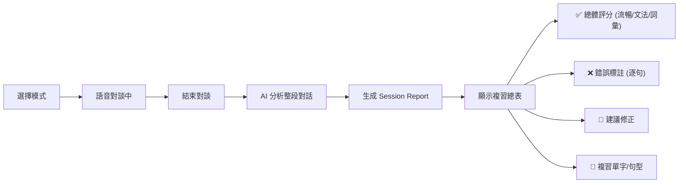
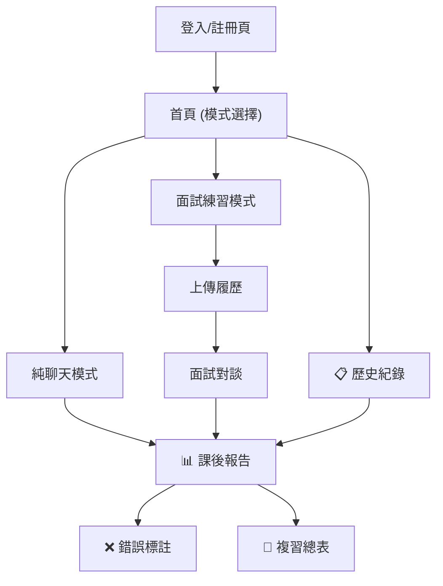

# AI English Speaking Practice Webapp — 更新架構書 v2

## 確認需求

| 項目 | 決定 |
|------|------|
| GPU | RTX 4070S 12GB VRAM — 可跑所有模型全尺寸 |
| 部署 | 先本地開發，未來上雲端 |
| 認證 | 簡易登入系統 (JWT) |
| 平台 | iOS 優先 (Capacitor) |
| 評分 | 對談結束後：錯誤標註 + 評分 + 課後複習總表 |

---

## 技術棧 (最終版)

| 層級 | 技術 |
|------|------|
| 前端 | Vue.js 3 + Vite + Pinia |
| 行動端 | Capacitor.js (iOS) |
| 後端 | Django 5 + DRF + Channels |
| 認證 | djangorestframework-simplejwt |
| 即時通訊 | Django Channels + Redis |
| 資料庫 | PostgreSQL 16 + pgvector |
| LLM | Ollama → Llama 3.2 8B (12GB VRAM 綽綽有餘) |
| STT | faster-whisper large-v3 (GPU float16) |
| TTS | Kokoro TTS (CPU 即可，留 VRAM 給 STT/LLM) |
| Embeddings | all-MiniLM-L6-v2 |
| 文件解析 | PyMuPDF / python-docx |

---

## 新增功能：對話評分 + 課後複習

### 使用流程



### Session Report 資料模型

```python
class SessionReport(models.Model):
    conversation = models.OneToOneField(Conversation, on_delete=models.CASCADE)
    
    # 評分 (1-10)
    fluency_score = models.IntegerField()       # 流暢度
    grammar_score = models.IntegerField()       # 文法
    vocabulary_score = models.IntegerField()    # 詞彙
    overall_score = models.IntegerField()       # 總分
    
    summary = models.TextField()                # AI 總結
    created_at = models.DateTimeField(auto_now_add=True)

class MessageCorrection(models.Model):
    message = models.ForeignKey(Message, on_delete=models.CASCADE)
    original_text = models.TextField()          # 使用者原話
    corrected_text = models.TextField()         # 修正版本
    error_type = models.CharField(max_length=50)  # grammar/vocabulary/pronunciation
    explanation = models.TextField()            # 解釋

class ReviewItem(models.Model):
    report = models.ForeignKey(SessionReport, on_delete=models.CASCADE)
    item_type = models.CharField(max_length=20)  # word/phrase/grammar
    content = models.TextField()                 # 要複習的內容
    example_sentence = models.TextField()        # 例句
```

### 評分生成流程

對談結束時，後端將整段對話送給 LLM 進行分析：

```python
# backend/ai_services/review_service.py
REVIEW_PROMPT = """
Analyze this English conversation. The user is practicing English speaking.
Return a JSON with:
1. scores (fluency, grammar, vocabulary, overall) from 1-10
2. corrections: array of {original, corrected, error_type, explanation}
3. review_items: array of {type, content, example_sentence}
4. summary: brief encouraging feedback in Traditional Chinese

Conversation:
{conversation_text}
"""

class ReviewService:
    @staticmethod
    def generate_report(messages: list[dict]) -> dict:
        conversation_text = "\n".join(
            f"{m['role']}: {m['content']}" for m in messages
        )
        response = ollama.chat(
            model="llama3.2",
            messages=[{"role": "user", "content": REVIEW_PROMPT.format(
                conversation_text=conversation_text
            )}],
            format="json"
        )
        return json.loads(response["message"]["content"])
```

---

## 更新後的目錄結構 (差異)

```
backend/
├── accounts/                  # [新增] 認證 App
│   ├── models.py              # 自訂 User Model
│   ├── serializers.py         # 註冊/登入 serializer
│   ├── views.py               # JWT 登入/註冊/刷新
│   └── urls.py
├── chat/
│   ├── models.py              # + SessionReport, MessageCorrection, ReviewItem
│   └── views.py               # + 結束對話 & 生成報告 API
├── ai_services/
│   └── review_service.py      # [新增] 對話分析 & 評分
```

---

## API 端點設計

### 認證
| Method | Endpoint | 功能 |
|--------|----------|------|
| POST | `/api/auth/register/` | 註冊 |
| POST | `/api/auth/login/` | 登入 (取得 JWT) |
| POST | `/api/auth/refresh/` | 刷新 Token |

### 對話
| Method | Endpoint | 功能 |
|--------|----------|------|
| GET | `/api/conversations/` | 列出對話紀錄 |
| POST | `/api/conversations/` | 建立新對話 (指定模式) |
| POST | `/api/conversations/{id}/end/` | 結束對話 → 觸發評分 |
| GET | `/api/conversations/{id}/report/` | 取得課後報告 |
| WS | `/ws/chat/{conversation_id}/` | 語音對談 WebSocket |

### RAG
| Method | Endpoint | 功能 |
|--------|----------|------|
| POST | `/api/documents/upload/` | 上傳履歷 |
| GET | `/api/documents/` | 列出已上傳文件 |
| DELETE | `/api/documents/{id}/` | 刪除文件 |

### 複習
| Method | Endpoint | 功能 |
|--------|----------|------|
| GET | `/api/reports/` | 列出所有報告 |
| GET | `/api/reports/{id}/corrections/` | 取得錯誤標註 |
| GET | `/api/reports/{id}/review-items/` | 取得複習項目 |

---

## 前端頁面規劃



| 頁面 | 路由 | 說明 |
|------|------|------|
| 登入/註冊 | `/login` | JWT 認證 |
| 首頁 | `/` | 模式選擇 + 快捷入口 |
| 純聊天 | `/chat/:id` | 語音對話介面 |
| 面試練習 | `/interview/:id` | 語音對話 + 履歷上下文 |
| 上傳履歷 | `/documents` | 管理上傳文件 |
| 歷史紀錄 | `/history` | 過去對話列表 |
| 課後報告 | `/report/:id` | 評分 + 錯誤 + 複習 |
| 設定 | `/settings` | 語速/模型設定 |

---

## 開發階段 (6 Phase)

### Phase 1 — 基礎建設 (Day 1-2)
- Docker Compose (PostgreSQL + Redis)
- Django 專案初始化 + accounts app (JWT)
- Vue.js + Vite 專案初始化
- Django Channels 設定

### Phase 2 — AI 服務 (Day 3-4)
- Ollama 安裝 + 拉取 llama3.2
- stt_service (faster-whisper GPU)
- llm_service (Ollama)
- tts_service (Kokoro CPU)

### Phase 3 — 純聊天模式 (Day 5-7)
- WebSocket Consumer (STT→LLM→TTS)
- 前端錄音 + WebSocket + 音訊播放
- 對話 UI + 歷史紀錄

### Phase 4 — 面試模式 RAG (Day 8-9)
- 文件上傳 + 解析 + 向量化
- pgvector 檢索整合
- 面試模式 prompt

### Phase 5 — 評分 & 複習 (Day 10-11)
- 結束對話觸發 LLM 分析
- SessionReport 生成
- 錯誤標註 + 複習總表 UI

### Phase 6 — iOS 打包 (Day 12-13)
- Capacitor iOS 設定
- 麥克風權限
- Xcode 建置 + 真機測試

---

## User Review Required

> [!IMPORTANT]
> 1. **評分語言**：課後報告的 AI 回饋要用**中文**還是**英文**？目前設定為繁體中文。
> 2. **UI 風格偏好**：有偏好深色/淺色主題嗎？或是兩者都支援？
> 3. **對話時長**：是否要限制單次對話時長？或自由對談無限制？

請確認以上內容，確認後我就開始實作 Phase 1。
